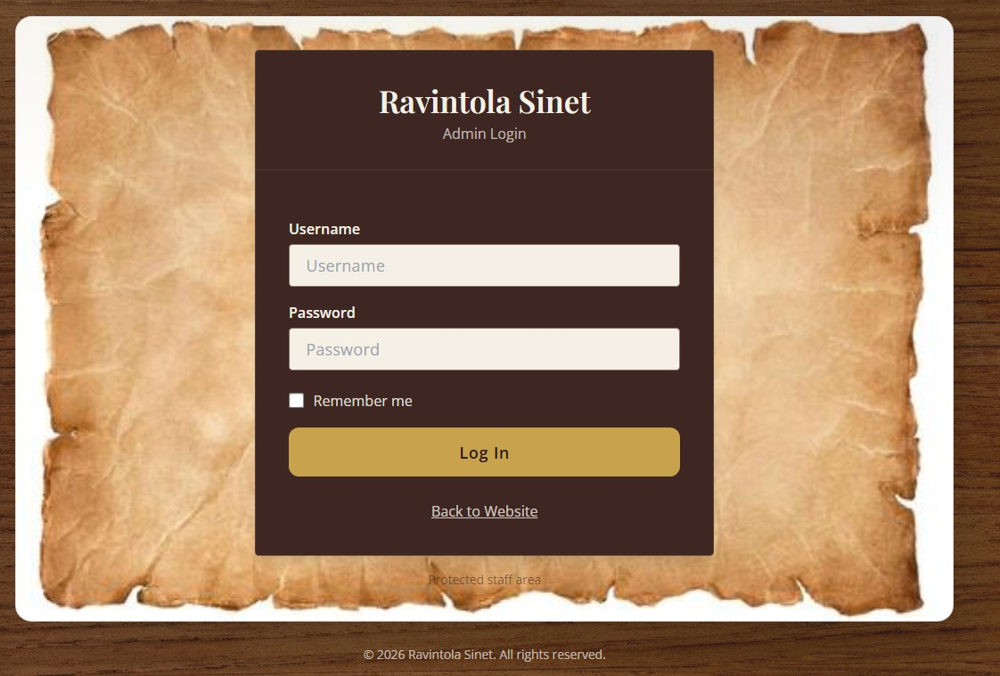
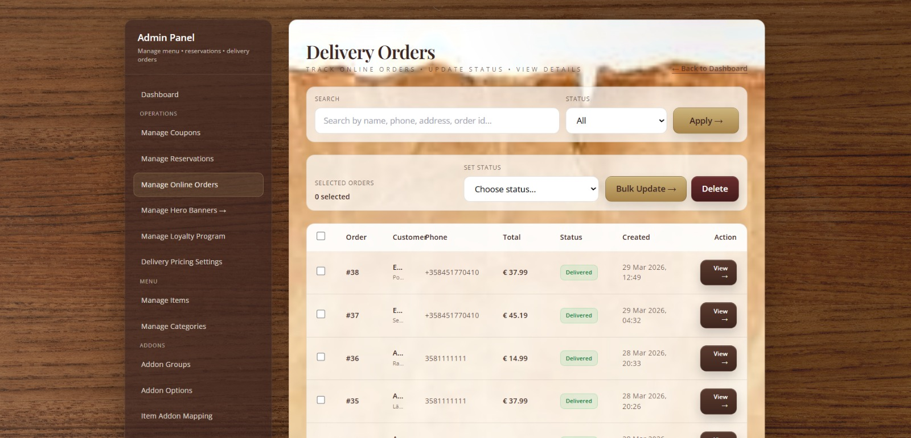
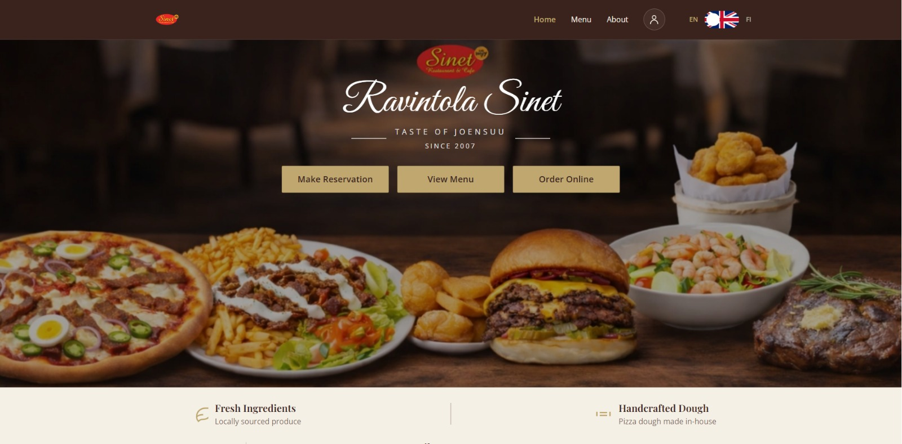
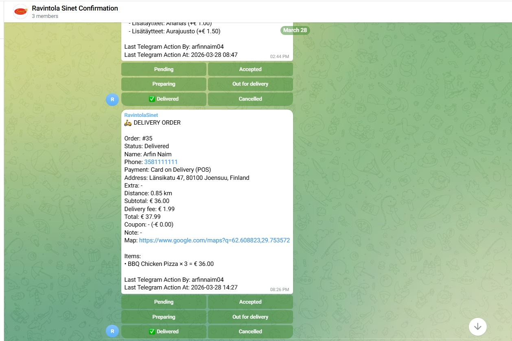

<h1 align="center">🍽️ Ravintola Sinet</h1>

  <b>Django-based Restaurant Management System</b> 
  Backend • Automation • VPS Deployment

  
  
  
  
  

---

## 📌 Overview

Ravintola Sinet is a backend-driven restaurant management system designed to handle real-world restaurant operations.  
It focuses on scalable backend logic, database management, and automation using Telegram bot integration.

---

## 🚀 Features

- 🛒 Order and menu management  
- ⚙️ Backend admin operations  
- 🗄️ PostgreSQL database integration  
- 🤖 Telegram bot automation for real-time updates  
- 🌐 VPS deployment (production environment)  
- 🔄 Git-based deployment workflow  

---

## 🛠️ Tech Stack

| Category | Technologies |
|--------|-------------|
| Backend | Python, Django |
| Database | PostgreSQL |
| Automation | Telegram Bot API |
| Frontend | HTML, CSS, JavaScript |
| DevOps | VPS (Linux), Git |

---

## 🔥 Key Highlights

- Built a real-world backend system for restaurant operations  
- Deployed and maintained application on live VPS  
- Integrated Telegram bot for backend automation workflows  
- Handled production-level debugging, migrations, and performance issues  

---

## 📸 Screenshots

| 🧑‍💼 Admin Panel | 🛒 Order System |
|----------------|----------------|
|  |  |

| 🏠 Homepage | 🤖 Telegram Bot |
|------------|----------------|
|  |  |

---

